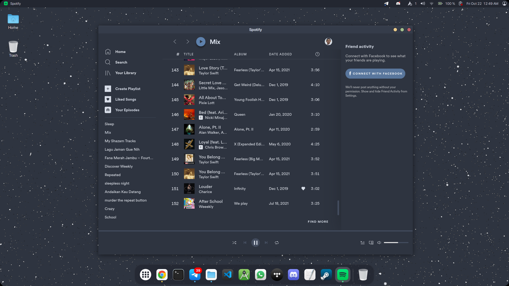
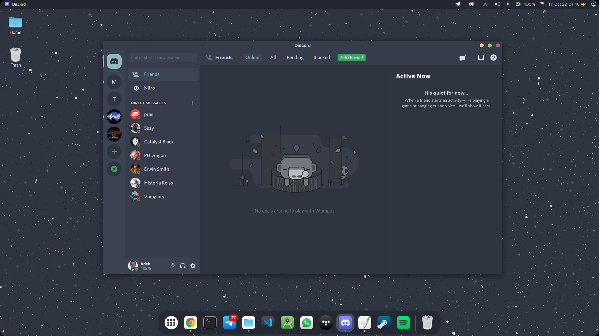
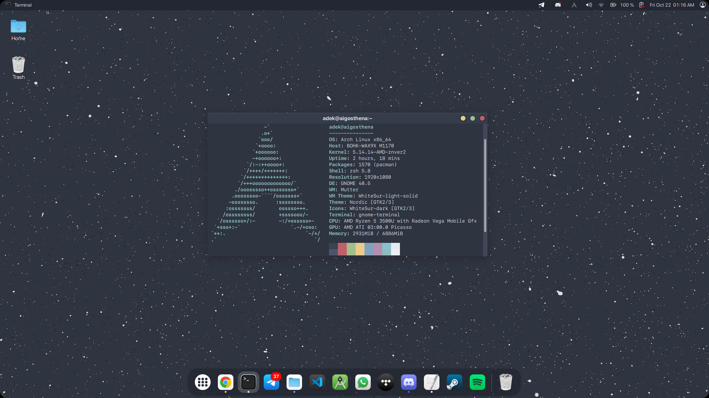
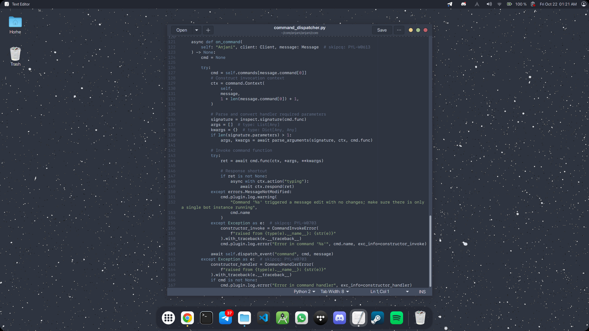
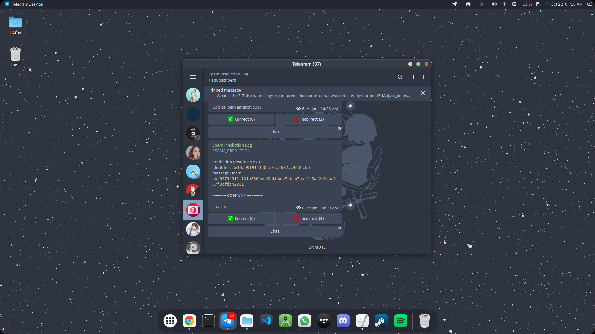

# Nord Gnome Setup

Minimalist Arch Linux GNOME [Nord](https://www.nordtheme.com/).

## Screenshots

### Spotify
Source: [spicetify-themes](https://github.com/morpheusthewhite/spicetify-themes)

### Discord
Source: [discord-nordic](https://github.com/orblazer/discord-nordic)

### Gnome Terminal
Sources:
- [Profile](https://github.com/arcticicestudio/nord-gnome-terminal)
- [oh-my-zsh-theme](https://github.com/sindresorhus/pure)

### Gedit
Source: [nord-gedit](https://github.com/arcticicestudio/nord-gedit)

### Telegram
Source: [telegram-theme](https://t.me/addtheme/nord_colors)

## Miscellaneous

### Extensions
- [ArcMenu](https://extensions.gnome.org/extension/3628/arcmenu/)
- [Big Sur Status Area](https://extensions.gnome.org/extension/4085/big-sur-status-area/)
- [Colored Application Menu Icon](https://extensions.gnome.org/extension/4408/app-menu-icon-remove-symbolic/)
- [Dash to Dock](https://extensions.gnome.org/extension/307/dash-to-dock/)
- [Desktop Icons: Neo](https://extensions.gnome.org/extension/4337/desktop-icons-neo/)
- [fluoroom's Top Bar](https://extensions.gnome.org/extension/4350/fluorooms-top-bar/), with a little changes.
- [Rounded Corners](https://extensions.gnome.org/extension/1514/rounded-corners/)

### Font Family
`SF Pro Display`

### Wallpapers
- [Wallpapers](https://github.com/dxnst/nord-wallpapers)

### Others
- [awesome-nord](https://github.com/Aceto1/awesome-nord)

